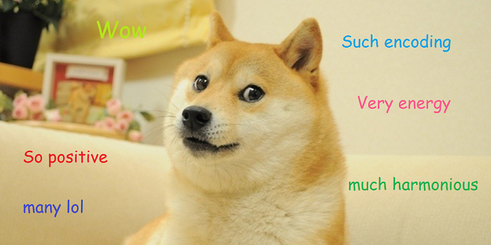

# ShunEncode - 巷议

这个程序通过对信息文本进行简单混淆来绕过敏感词程序的审查（类似于[ROT13](https://en.wikipedia.org/wiki/ROT13)）。

在线体验：<https://jex.im/ShunEncode/>




##  Install

```
npm install shun-encode
```


## Use in Node.js

```javascript
var ShunEncode = require("shun-encode");
var s = "我爱老大哥!";
var enableZEnergy = true;
var s1 = ShunEncode.encode(s,enableZEnergy);
var s2 = ShunEncode.decode(s1);
s2 === s; // => true
```
